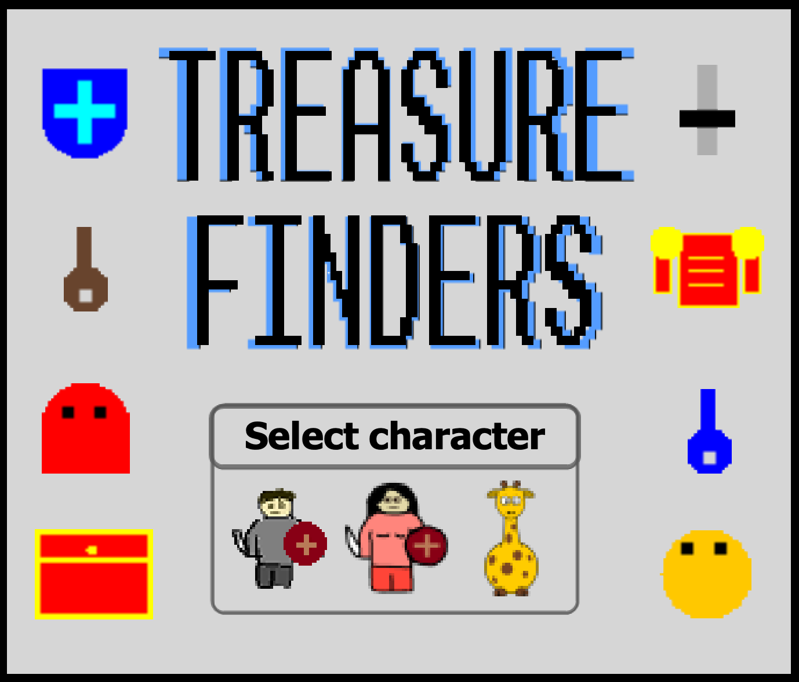
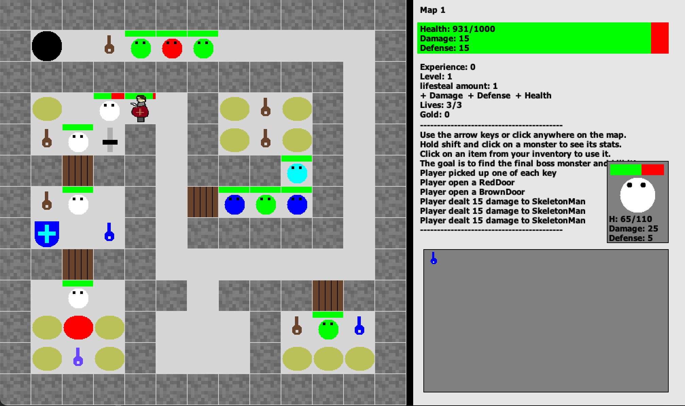
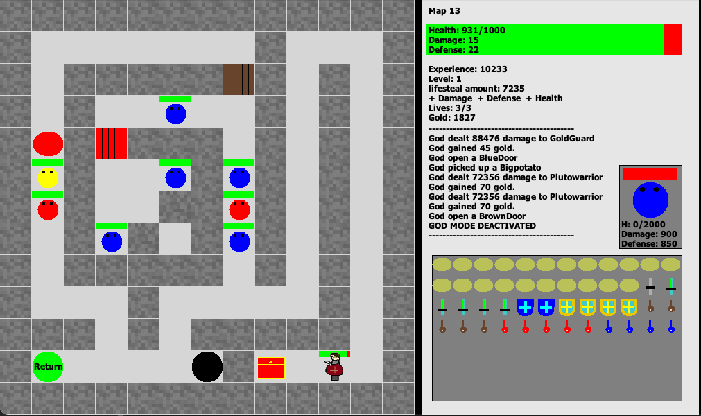
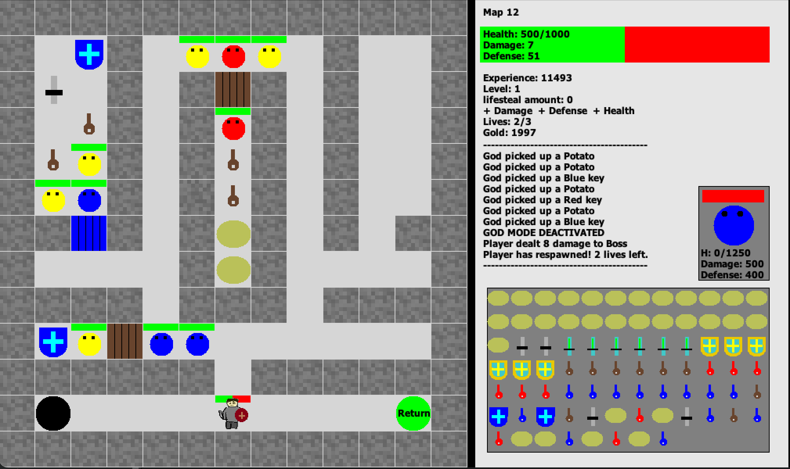

# Treasure Finders

**Treasure Finders** is a Java-based adventure game developed by a team of three as a semester-long Computer Science project. The game challenges players to explore dungeons, collect items, and ultimately defeat a powerful boss.


## Screenshots


The title screen.


The player is engaging in combat with a SkeletonMan.


The player has found a hidden treasure.


The player has picked up a variety of items and is on map 12.

<!-- Add boss -->
<!--  -->


## Gameplay Guide

- **Select a character**: Choose from different players at the start.
- **Explore the dungeon**: Move using arrow keys, WASD keys, or point-and-click with the mouse.
- **Collect items**:
   - **Potatoes**: Heal your health.
   - **Swords**: Gain power to defeat monsters.
   - **Shields**: Gain defense to protect yourself from monsters.
   - **Keys**: Open doors.

- **Search for treasure**: Treasure chests contain valuable items and upgrades.
- **Defeat enemies**: Battle the monsters by moving towards them or clicking on them.
- **Defeat the boss**: Your ultimate goal is to defeat the final boss and win the game.


## Download and Play
### Option 1: Download the JAR file (Fastest)
1. [Download the `Treasure-Finders.jar` file](https://github.com/ElkinsCS3/Treasure-Finders/raw/master/Treasure-Finders.jar) from this repository.
   - Java (specifically a JRE - Java Runtime Environment) is needed to run this file. [Download it here](https://www.java.com/en/download) if necessary. (Note: Macs with Intel processors need the x86_64 version linked below the download button.)
2. **On macOS:**
   - Opening the JAR may show a warning that Apple could not verify that it is free of malware. This is expected for unsigned apps. You can safely allow it by following these steps:
     - Go to **System Settings > Privacy & Security > Security** and look for "Treasure-Finders.jar" and click "Open Anyway".
3. **On Windows:**
   - Double click the JAR file. If it doesn't run, make sure you have Java installed. You may need to right click and select **Open with > Java**.

### Option 2: Compile and Run Files
#### If you have Git:
  1. Clone the repository:
     ```sh
     git clone https://github.com/ElkinsCS3/Treasure-Finders.git
     ```
#### If you don't have Git:
  1. Click the green **Code** button and select **Download ZIP** at the bottom of the pop-up.
  2. Unzip the file and open the folder.

#### Then run the `Runner.java` file.
1. Make sure you have a JDK installed (Java 8 or later, if not, see [these](https://www.freecodecamp.org/news/install-openjdk-free-java-multi-os-guide/?utm_source=chatgpt.com) or [these](https://www.geeksforgeeks.org/download-and-install-java-development-kit-jdk-on-windows-mac-and-linux/?utm_source=chatgpt.com) instructions).
2. From the root folder of the project, run this command:
   ```sh
   java Treasure-Finders/Runner
   ```
Alternatively, load all the files into any IDE that supports Java (for example Eclipse, VSCode, IntelliJ, or JCreator), then run the `Treasure-Finders/Runner.java` file.


## Features

- **A\* pathfinding**: Point-and-click movement automatically computes the shortest path.
- **Inventory system**: Array-based inventory with sorting.
- **Grid-based maps**: Dungeon maps using matrices.
- **Combat system**: Fight monsters.
- **Event handling**: Keyboard and mouse listeners for responsive controls.


## Technologies Used

- **Java 8** 
   - **Java Swing package**
   - **Java AWT package** 
   - **Java Sound API** 

